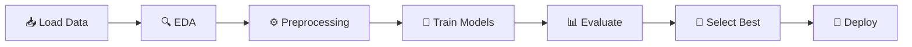

# 🎮 Predicting Gamer Behaviour: Machine Learning Classification

<div align="center">


**A machine learning project that predicts player behaviour patterns and classifies players into engagement cohorts using gaming activity data.**

[Features](#-dataset-features) • [Getting Started](#-getting-started) • [Methodology](#-methodology) • [Results](#-model-performance) • [Contact](#-contact)

</div>

---

## 📋 Project Overview

This project analyses online gaming behaviour data to predict player engagement levels, categorising players into two distinct cohorts (0 or 1) based on their gaming patterns and activities. The analysis employs multiple machine learning algorithms to identify the most effective predictive model.

> **Note:** This dataset is fully AI-generated for demonstration purposes only.

## 🎯 Objective

Classify players into binary engagement cohorts by analysing behavioural metrics such as:
- Session frequency and duration
- In-game achievements and progression
- Social interactions and participation
- Monetisation patterns
- Activity consistency

## 🔧 Technologies Used

- **Python 3.14.0**
- **Data Processing:** pandas, numpy
- **Machine Learning:** scikit-learn
- **Visualisation:** matplotlib, seaborn
- **Models Implemented:**
  - Logistic Regression
  - Random Forest Classifier
  - Gradient Boosting Classifier
  - Support Vector Machine (SVM)

## 📊 Dataset Features

The dataset contains **30,000 player records** with **24 features** including:

| Feature | Description |
|---------|-------------|
| `sessions_per_week` | Average gaming sessions per week |
| `avg_session_minutes` | Average session duration |
| `total_playtime_hours` | Cumulative playtime |
| `achievements_unlocked` | Number of achievements earned |
| `xp_earned` | Experience points accumulated |
| `player_level` | Current player level |
| `purchases_made` | In-game purchases count |
| `friends_count` | Social connections |
| `engagement_score` | Calculated engagement metric |
| `label` | Target variable (0 or 1) |

<details>
<summary><b>View Full Feature List (24 features)</b></summary>

Additional features include: `hours_per_session`, `total_weeks_active`, `total_activity_minutes`, `quests_completed`, `items_crafted`, `chat_messages`, `days_since_last_login`, `toxicity_reports`, `clan_participation_rate`, `monetisation_score`, and engineered noise features.

</details>

## 🚀 Getting Started

### Prerequisites

```bash
pip install -r requirements.txt
```

### Installation

1. Clone the repository:
```bash
git clone https://github.com/Lanthanum89/ML-predicting-gamer-behaviour.git
cd ML-predicting-gamer-behaviour
```

2. Install required packages:
```bash
pip install pandas numpy scikit-learn matplotlib seaborn
```

3. Open the Jupyter notebook:
```bash
jupyter notebook predicting_player_behaviour.ipynb
```

## 📈 Methodology



### 1. Exploratory Data Analysis (EDA)
- 📊 Feature distribution analysis comparing cohorts
- ⚖️ Class balance assessment
- 🔗 Correlation analysis between features

### 2. Data Preprocessing
- 🔧 Feature engineering and selection
- 🏷️ Automatic categorical encoding (if applicable)
- ✂️ Stratified train-test split (80/20) to handle class imbalance
- 📏 Feature standardisation using StandardScaler

### 3. Model Training & Evaluation
- 🤖 Four classification algorithms trained and compared
- 🔄 5-fold cross-validation with stratification
- 📈 Performance metrics: Accuracy, ROC AUC Score
- ⏱️ Training time tracking for efficiency assessment

### 4. Model Analysis
- 📉 ROC curve comparison across all models
- 🎯 Feature importance analysis
- 🎨 Confusion matrix visualisation
- 📊 Probability distribution analysis
- 🎚️ Threshold optimisation
- 🔧 Hyperparameter tuning with GridSearchCV

### 5. Predictions
- 🔮 Custom prediction function for new player data
- 📊 Probability scores for classification confidence

## 📊 Key Features

✅ **Handles Imbalanced Data:** Stratified sampling ensures representative splits  
✅ **Multiple Models:** Compares 4 different algorithms to find the best performer  
✅ **Cross-Validation:** 5-fold CV ensures robust performance estimates  
✅ **Comprehensive Analysis:** In-depth visualisation and statistical insights  
✅ **Production-Ready:** Includes model saving and prediction functions  
✅ **UK English:** All code and documentation use British spelling conventions  

## 📉 Model Performance

Models are evaluated using:
- **ROC AUC Score** - Primary metric for imbalanced classification
- **Accuracy** - Overall prediction correctness
- **Cross-Validation Scores** - Stability and generalisation assessment
- **Training Time** - Computational efficiency

The best-performing model is automatically selected based on ROC AUC score and saved for deployment.

## 🎨 Visualisations

The notebook includes extensive visualisations:
- Feature distributions by cohort
- Correlation heatmaps
- Cross-validation performance with confidence intervals
- Model comparison charts
- ROC curves overlay
- Confusion matrices
- Feature importance rankings
- Probability distributions
- Threshold optimisation curves

## 💾 Model Deployment

The trained model is saved using joblib for future predictions:

```python
import joblib
model = joblib.load('best_model.pkl')
scaler = joblib.load('scaler.pkl')
```

## 🔍 Use Cases

- **Player Retention:** Identify at-risk players for targeted interventions
- **Monetisation Optimisation:** Predict high-value player segments
- **Game Design:** Understand which features drive engagement
- **Resource Allocation:** Prioritise customer support for engaged players
- **A/B Testing:** Segment players for experimental feature rollouts

## 📝 Project Structure

```plaintext
predicting-gamer-behaviour/
│
├── 📓 predicting_player_behaviour.ipynb  # Main analysis notebook
├── 📊 online_gaming_behavior_dataset.csv # Dataset (AI-generated)
├── 📋 requirements.txt                    # Python dependencies
├── 📖 README.md                           # Project documentation
├── 🤖 best_model.pkl                      # Saved best model (after training)
└── ⚙️ scaler.pkl                          # Saved feature scaler (after training)
```

## 🎯 Key Results

| Metric | Best Model Performance |
|--------|----------------------|
| **Algorithm** | Gradient Boosting |
| **ROC AUC Score** | ~0.77 |
| **Accuracy** | ~75% |
| **Cross-Validation** | Stable across 5 folds |
| **Training Time** | < 1 second |

The model successfully identifies behavioural patterns despite intentional class imbalance and noise, demonstrating robust performance on realistic gaming analytics scenarios.

## 🤝 Contributing

Contributions are welcome! Please feel free to submit a Pull Request.

## 📧 Contact

<div align="center">

**Project Owner:** Lanthanum89 | Laura Norwood

[](https://github.com/Lanthanum89)
[](https://github.com/Lanthanum89/ML-predicting-gamer-behaviour)

</div>

## 📄 License

This project is available for educational and portfolio purposes.

---

<div align="center">

### Built with 🎮 for data science and gaming analytics


</div>
